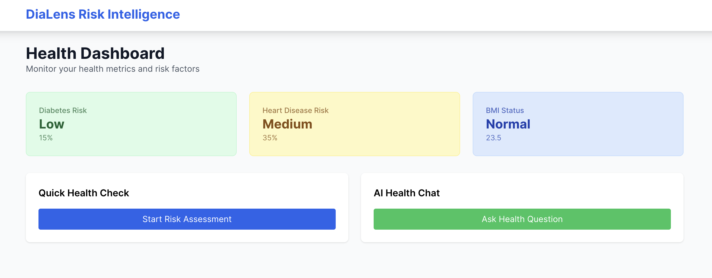
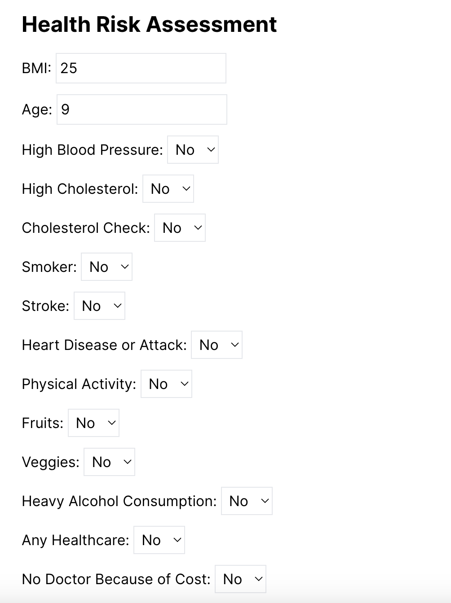
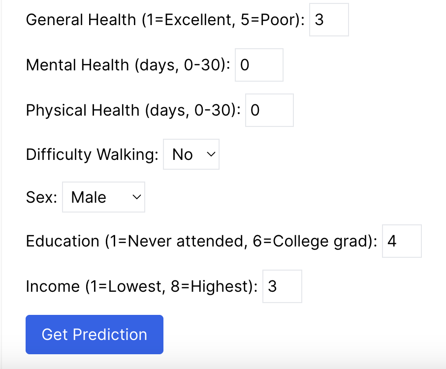
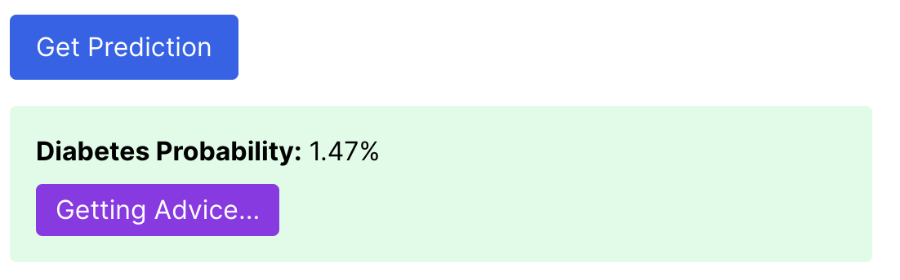

# Dialens Risk Intelligence

 

---

## Overview

**Dialens Risk Intelligence** is an AI-powered web application that predicts an individual's risk of developing diabetes using advanced neural networks and provides personalized health advice. The platform leverages real-world health indicators and machine learning to empower users with actionable insights for better health management.

---

## Features

- **Diabetes Risk Prediction:**  
  Enter your health indicators and receive an instant, AI-driven diabetes risk score.
   
  

- **Personalized Health Advice:**  
  Get tailored recommendations based on your risk profile and health data.
  
  ![Response Result Screenshot][def]
- **Interactive Dashboard:**  
  Visualize your risk, BMI, and other health metrics in an intuitive interface.

- **Modern Neural Network Model:**  
  Utilizes a deep learning model trained on the [BRFSS 2015 Diabetes Dataset](https://www.cdc.gov/brfss/index.html) for high accuracy and reliability.

- **Data Privacy:**  
  Your data is never stored or shared. All predictions are computed in real-time.

---

## How It Works

1. **Input:**  
   Users fill out a health form with indicators such as blood pressure, cholesterol, BMI, lifestyle habits, and more.

2. **Prediction:**  
   The backend neural network processes the data, scales features, and predicts diabetes risk probability.

3. **Advice:**  
   The app provides actionable health advice and resources tailored to your risk factors.

---

## Model Details

- **Model Type:** Deep Neural Network (Keras)
- **Features Used:**  
  `HighBP`, `HighChol`, `CholCheck`, `BMI`, `Smoker`, `Stroke`, `HeartDiseaseorAttack`,  
  `PhysActivity`, `Fruits`, `Veggies`, `HvyAlcoholConsump`, `AnyHealthcare`, `NoDocbcCost`,  
  `GenHlth`, `MentHlth`, `PhysHlth`, `DiffWalk`, `Sex`, `Age`, `Education`, `Income`
- **Performance:**  
  - Test Accuracy: ~0.75  
  - ROC AUC: ~0.82  
  - High recall for diabetes detection

---

## Tech Stack

- **Frontend:** React.js, Chart.js, CSS
- **Backend:** Python, Django REST Framework, TensorFlow/Keras, scikit-learn
- **ML Libraries:** TensorFlow, scikit-learn, imbalanced-learn (SMOTE)
- **Deployment:** To be continued, plan to use Vercel for deployment

---

## Setup & Usage

1. **Clone the repository:**
   ```bash
   git clone https://github.com/yilinw762/dialens-risk-intelligence.git
   cd dialens-risk-intelligence
2. **Backend setup:**
   Create and activate a virtual environment:
   python3 -m venv .venv
   source .venv/bin/activate
   Install backend dependencies:
   pip install -r requirements.txt
   Place your trained model (diabetes_nn_model.keras) and scaler (diabetes_scaler.pkl) in model_files.
   Start the Django backend server:
   cd backend
   python3 manage.py runserver
3. **Frontend setup:**
   Open a new terminal
   Navigate to the frontend directory:
   cd frontend
   Install frontend dependencies:
   npm install
   Start React development server:
   npm start
   The app will be available at http://localhost:3000.


[def]: ./Images/Response.png